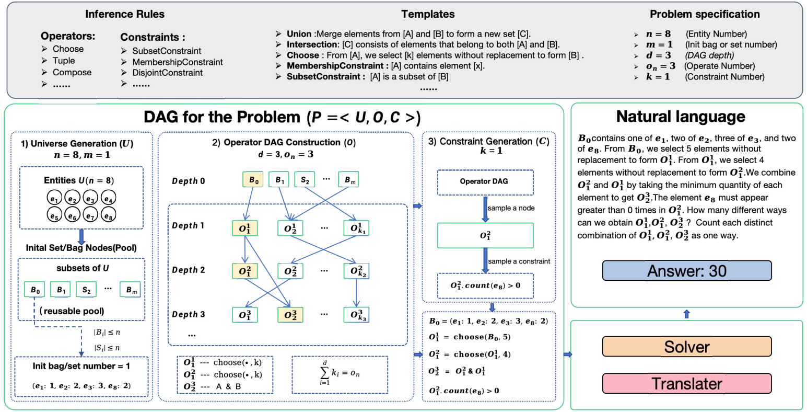

# Combinatorial Problem Generator

A DAG-based system for automatically generating and solving combinatorial mathematics problems with natural language descriptions.



## Quick Start

```bash
# Install dependencies
uv sync

# Generate a single problem
uv run generator.py

# Batch generate problems
uv run main.py --config configs/single-operate/CHOOSE.json
```

## Usage

### Single Problem Generation

```bash
uv run generator.py
```

Generates one problem and prints:
- Cofola code (for solver input)
- Natural language description

### Batch Problem Generation

```bash
uv run main.py --config <config_file>
```

Generate multiple problems with specified configuration. Example:

```bash
uv run main.py --config configs/single-operate/CHOOSE.json --output-dir data/my_problems
```

### Solve Problems

```bash
uv run solve.py --problems  data/my_problems  --output  data/my_problems_solved --threads 4 --timeout 60
```

## Configuration

Edit config JSON files in `configs/` directory:

| Parameter | Description |
|-----------|-------------|
| `entity_counts` | Number of entities per problem |
| `operator_counts` | Number of operators per problem |
| `constraint_counts` | Number of constraints per problem |
| `allowed_operators` | List of operator types to use |
| `allowed_constraints` | List of constraint types to use |
| `num_problems_per_config` | Problems per configuration |

## Problem Format

Each generated problem includes:
- `cofola_code`: Formal representation for solver
- `natural_language`: Human-readable description
- `operators`: List of operators used
- `constraints`: List of constraints applied
